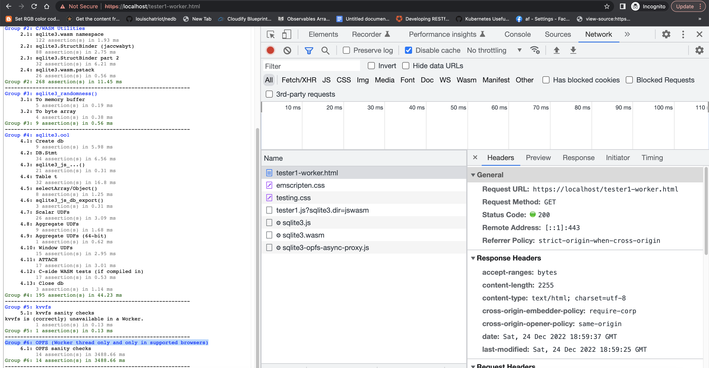

**[Exp-1] SQLite3 wasm in POFS**

** The code served from /assets was taken from the [official source](https://sqlite.org/download.html).

**Description:**

Sqlite-3 wasm using private origin file system API.
Let's run a DB which its file is saved on the user's filesystem.

**How to start:**

TLS, Self signed Cert:

Here are the steps to generate a self-signed SSL certificate and private key using openssl:

Generate a private key using the openssl genrsa command. For example:

`openssl genrsa -out server.key 2048
`

Generate a certificate signing request (CSR) using the openssl req command. For example:

`openssl req -new -key server.key -out server.csr
`

Generate a self-signed SSL certificate using the openssl x509 command. For example:

`openssl x509 -req -days 365 -in server.csr -signkey server.key -out server.crt
`

Start the server:
`go run main.go`

Browse to: `https://localhost/tester1-worker.html`

Disclaimer - I'm not using it in production or in a lib I'm maintaining.